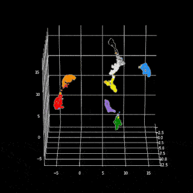

# bayesVec2Midi

      

Use Bayesian optimisation to convert image's  main color into music, Python 2020.

____

## Table of Contents
  * [Description](#description)
  * [Sources](#sources)
____
## Description

We can encode any dataset into smaller dimension space with the help of Metric Learning approaches, such as Siamese Learning, Self-Learning, Triplet-Learning. To simplify research, an image's dataset with color that attracts most attention as labels was constructed and trained with triplets. You can see the resulting embedding space of images, projected to 3d space with [UMAP](https://arxiv.org/abs/1802.03426) here:

      

Network was trained in [__Image2Vec_learning.ipynb__](Image2Vec_learning.ipynb) notebook.

You can find Image2Vec convertion in [__Image2Vec_prediction.ipynb__](Image2Vec_prediction.ipynb) notebook.

__Bayesian Search__ of transition matrix's weights to map embedding's space to Google's [`musicVAE`](https://github.com/magenta/magenta/tree/master/magenta/models/music_vae) latent space. The task of matching embeddings to [musicVAE](https://github.com/magenta/magenta/tree/master/magenta/models/music_vae) latent space have several difficulties. To start with, we want to distinguishably compare melodies __not__ in the latent space, but in the final midi form.

That implies that we __can't calculate gradients__ with respect to weights, so we can't use family of __Gradient Descent Optimisation's__ algorithms. That's why we can either randomly pick weights until good metric score or use Bayesian Optimisation, which take into account previous attempts. That helps to converge faster that Random Search in general. 

That means we need to somehow compare different sequences with not equal lengths. [__Existing approaches__](https://digital.csic.es/bitstream/10261/3163/1/ismir04.pdf) either calculate area between melodies interpolated to the same length or use some versions of [__Dynamic Time Warping__](https://en.wikipedia.org/wiki/Dynamic_time_warping) algorithm. Our approach uses it's own midi sequences similarity function. This function takes into account difference in pitches, difference in durations and difference in first notes and use Manhattan Distance to get final score. Manhattan distance is often used in practice to compare signals and melodies sequences are some kind of signals.

Frankly speaking, using bayesian search to find weights of transition matrix is a bad idea. There are __latent_space_size__ times __embedding_size__ number of parameters to optimize. Or 512x9~=__5k parameters__. A rule of thumb is to use __12-16 times__ iterations as number of parameters. Considering that bayesian optimisation is __O(n^3)__ due to necessity of finding inverse matrix, where __n__ is the number of parameters, this optimisation can take __years__. To leverage this problem this module use parameters reduction through [Gaussian random projection](https://arxiv.org/pdf/1809.02209.pdf). So instead of finding matrix weights we search __100__ coefficients of linear combination of randomly generated matrices. Thus, number of parameters was dropped fiftyfold.

You can find Vec2Midi learning in [__music_learning.py__](music_learning.py) script.

It's worth to mention that `musciVAE` latent space has some garbage dimensions which affects the generated melodies only by small amount. 

      

In the research was have shown that only 10-20 dimensions of musicVAE latent space are vital to melodies generations.

      

After training we use nearest cluster's center in embedding space to generate melodies. You can see the example of pipeline in the [__Pipeline.ipynb__](Pipeline.ipynb). The results  visualized with [__Synthesia__](https://synthesiagame.com/) are shown bellow:

      

____

